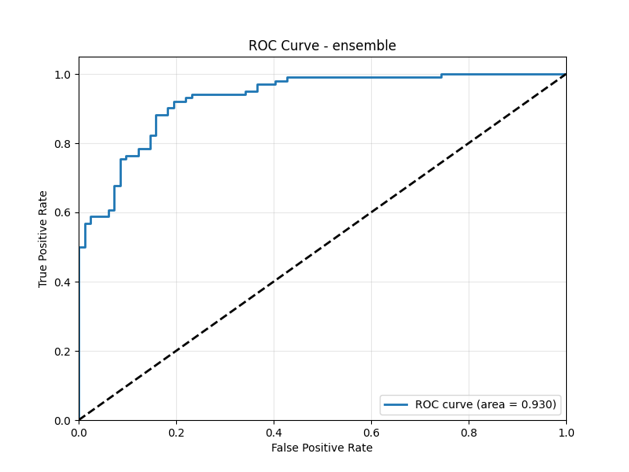

# Heart Disease Prediction System

A comprehensive machine learning system for predicting heart disease risk based on clinical parameters, using Multi-Layer Perceptron (MLP) neural networks.



## Table of Contents

- [Overview](#overview)
- [Features](#features)
- [Project Structure](#project-structure)
- [Getting Started](#getting-started)
  - [Prerequisites](#prerequisites)
  - [Installation](#installation)
- [Usage Guide](#usage-guide)
  - [Data Processing](#data-processing)
  - [Model Training](#model-training)
  - [Making Predictions](#making-predictions)
  - [API Service](#api-service)
  - [Docker Deployment](#docker-deployment)
- [Model Architecture](#model-architecture)
- [Performance Metrics](#performance-metrics)
- [CI/CD Pipeline](#cicd-pipeline)
- [Documentation Index](#documentation-index)
- [License](#license)

## Overview

This system provides end-to-end machine learning infrastructure for predicting heart disease risk. It implements both scikit-learn and TensorFlow/Keras MLP models, combining them into an ensemble for improved prediction accuracy. The project follows a modular architecture with separate components for data processing, feature engineering, model training, evaluation, and deployment.

The system takes medical parameters (such as age, cholesterol levels, blood pressure, etc.) as input and predicts the risk of heart disease, along with a clinical interpretation of the results. It can be used through a command-line interface, a REST API, or deployed as a containerized service.

## Features

- **Data Processing Pipeline**:
  - Automated data cleaning and normalization
  - Feature engineering for medical parameters
  - Train/validation/test splitting with stratification

- **Multiple ML Models**:
  - scikit-learn MLP with optimized configuration
  - Keras/TensorFlow deep learning model
  - Ensemble methodology combining predictions

- **Advanced ML Techniques**:
  - Hyperparameter tuning using Optuna
  - Cross-validation strategies for robust evaluation
  - Feature importance analysis

- **Prediction System**:
  - Clinical risk level interpretation
  - Confidence scoring
  - Ensemble voting mechanism

- **Deployment Options**:
  - Command-line interface for batch predictions
  - FastAPI REST API for real-time predictions
  - Docker containerization for easy deployment
  - Comprehensive health checks and monitoring

- **DevOps Integration**:
  - GitHub Actions for CI/CD
  - Automated testing and code quality checks
  - Security scanning for dependencies and images
  - Scheduled model retraining and evaluation

## Project Structure

```
heart-disease-mlp/
├── .github/                # GitHub configuration
│   ├── workflows/          # CI/CD workflows
│   └── CICD_SETUP.md       # CI/CD setup documentation
├── api/                    # API implementation
│   └── app.py              # FastAPI application
├── config/                 # Configuration files
│   └── config.yaml         # Main configuration
├── data/                   # Data storage
│   ├── examples/           # Example input data
│   ├── external/           # External reference data
│   ├── processed/          # Processed datasets
│   └── raw/                # Raw datasets
├── docs/                   # Documentation
│   ├── api.md              # API documentation
│   ├── data_dictionary.md  # Data fields explanation
│   ├── model.md            # Model architecture details
│   └── usage.md            # Detailed usage instructions
├── models/                 # Trained models
│   ├── evaluation_results.joblib  # Performance metrics
│   ├── keras_mlp_model.h5         # Keras model weights
│   ├── optuna/                    # Hyperparameter tuning results
│   └── sklearn_mlp_model.joblib   # Scikit-learn model
├── notebooks/              # Jupyter notebooks for exploration
├── reports/                # Generated reports and visualizations
│   └── figures/            # Performance visualizations
├── scripts/                # Shell scripts for automation
│   ├── deploy_api.sh       # API deployment script
│   ├── get_data.sh         # Data download script
│   ├── process_data.sh     # Data processing script
│   ├── test_api.sh         # API testing script
│   └── train_models.sh     # Model training script
├── src/                    # Source code
│   ├── data/               # Data processing modules
│   ├── features/           # Feature engineering
│   ├── models/             # Model implementation
│   └── visualization/      # Visualization utilities
├── tests/                  # Automated tests
│   ├── test_api.py         # API tests
│   ├── test_data.py        # Data processing tests
│   └── test_models.py      # Model tests
├── Dockerfile              # Docker configuration
├── docker-compose.yml      # Docker Compose configuration
├── requirements.txt        # Python dependencies
└── setup.py                # Package installation
```

## Getting Started

### Prerequisites

- Python 3.8+ (3.10 recommended)
- pip (Python package manager)
- Docker & Docker Compose (optional, for containerized deployment)
- Git

### Installation

1. **Clone the repository:**

   ```bash
   git clone https://github.com/yourusername/heart-disease-mlp.git
   cd heart-disease-mlp
   ```

2. **Set up a Python virtual environment:**

   ```bash
   # Create a virtual environment
   python -m venv venv

   # Activate the environment
   # On Linux/macOS:
   source venv/bin/activate
   # On Windows:
   venv\Scripts\activate
   ```

3. **Install dependencies:**

   ```bash
   pip install -r requirements.txt

   # Install the package in development mode
   pip install -e .
   ```

4. **Verify installation:**

   ```bash
   # Run tests to ensure everything is working
   pytest tests/
   ```

## Usage Guide

### Data Processing

1. **Download and prepare the dataset:**

   ```bash
   # Download the heart disease dataset
   ./scripts/get_data.sh

   # Process the raw data
   ./scripts/process_data.sh
   ```

   This will:
   - Download the heart disease dataset from multiple sources
   - Clean and preprocess the data
   - Create train/validation/test splits
   - Save the processed data in `data/processed/`

2. **Data processing details:**

   The system uses several heart disease datasets from UCI ML Repository, combining them and applying:
   - Missing value imputation
   - Feature scaling (standardization)
   - Feature engineering for medical parameters
   - Stratified splitting to maintain class balance

### Model Training

1. **Train the models:**

   ```bash
   # Train with default hyperparameters
   ./scripts/train_models.sh

   # Train with hyperparameter tuning (takes longer)
   ./scripts/train_models.sh --tune
   ```

   This will:
   - Train a scikit-learn MLP model
   - Train a Keras/TensorFlow MLP model
   - Store trained models in the `models/` directory
   - Generate evaluation metrics and visualizations

2. **Hyperparameter tuning:**

   The system uses Optuna to optimize hyperparameters such as:
   - Learning rate
   - Network architecture (hidden layers and units)
   - Activation functions
   - Regularization parameters

   Tuning results are stored in `models/optuna/` for future reference.

### Making Predictions

1. **Using the command-line interface:**

   ```bash
   # Predict from a JSON file
   python src/models/cli_predict.py --input data/examples/patient_example.json

   # Get clinical interpretation
   python src/models/cli_predict.py --input data/examples/patient_example.json --interpretation

   # Use a specific model
   python src/models/cli_predict.py --input data/examples/patient_example.json --model keras
   ```

2. **Example input format (JSON):**

   ```json
   {
     "age": 61,
     "sex": 1,
     "cp": 3,
     "trestbps": 140,
     "chol": 240,
     "fbs": 1,
     "restecg": 1,
     "thalach": 150,
     "exang": 1,
     "oldpeak": 2.4,
     "slope": 2,
     "ca": 1,
     "thal": 3
   }
   ```

   See [data dictionary](docs/data_dictionary.md) for detailed field descriptions.

### API Service

1. **Start the API server:**

   ```bash
   # Start with default settings
   uvicorn api.app:app --reload

   # Or use the deployment script
   ./scripts/deploy_api.sh
   ```

   The API will be available at http://localhost:8000

2. **Access API documentation:**

   Interactive OpenAPI documentation is available at:
   - http://localhost:8000/docs (Swagger UI)
   - http://localhost:8000/redoc (ReDoc)

3. **Making API requests:**

   ```bash
   # Health check endpoint
   curl -X GET http://localhost:8000/health

   # Model information
   curl -X GET http://localhost:8000/models/info

   # Make a prediction
   curl -X POST http://localhost:8000/predict \
     -H "Content-Type: application/json" \
     -d '{
       "age": 65,
       "sex": 1,
       "cp": 0,
       "trestbps": 140,
       "chol": 220,
       "fbs": 1,
       "restecg": 0,
       "thalach": 150,
       "exang": 0,
       "oldpeak": 1.2,
       "slope": 2,
       "ca": 0,
       "thal": 2
     }'
   ```

   See [API documentation](docs/api.md) for more details.

### Docker Deployment

1. **Build and start services using Docker Compose:**

   ```bash
   # Build and start
   docker-compose up -d

   # Stop services
   docker-compose down
   ```

2. **Check logs:**

   ```bash
   docker-compose logs -f
   ```

3. **Test the containerized API:**

   ```bash
   # Test using provided script
   ./scripts/test_api.sh
   ```

### Cloud Deployment

For cloud deployment, this project uses Docker container images pushed to GitHub Container Registry (ghcr.io).
Refer to the GitHub Actions workflow configuration and deployment scripts for details on deploying to your chosen environment.

## CI/CD Pipeline

This project uses GitHub Actions for continuous integration and deployment:

1. **CI Pipeline**: Automatically runs tests, builds Docker image, and performs security scans
2. **CD Pipeline**: Deploys to staging and production environments
3. **Model Retraining**: Automatically retrains models on a monthly schedule

For setup instructions:
- See [CI/CD Setup Guide](.github/CICD_SETUP.md) for configuring the workflow
- See [Deployment Secrets Guide](.github/DEPLOYMENT_SECRETS.md) for setting up required secrets

## Model Architecture

The project implements two types of MLP models:

1. **Scikit-learn MLP**:
   - Three hidden layers (128, 64, 32 neurons)
   - ReLU activation functions
   - Adam optimizer
   - L2 regularization

2. **Keras MLP**:
   - Input layer matching feature dimensions
   - Three hidden layers with Dropout
   - BatchNormalization for improved training
   - ReLU activations and sigmoid output
   - Binary cross-entropy loss

3. **Ensemble Model**:
   - Combines predictions from both models
   - Weighted averaging of probabilities
   - Voting mechanism for final classification

For more details, see [model documentation](docs/model.md).

## Performance Metrics

The current models achieve the following performance on the test set:

| Model | Accuracy | Precision | Recall | F1 Score | ROC AUC |
|-------|----------|-----------|--------|----------|---------|
| Scikit-learn MLP | 85.3% | 0.858 | 0.841 | 0.849 | 0.929 |
| Keras MLP | 85.3% | 0.845 | 0.870 | 0.857 | 0.926 |
| Ensemble | 86.4% | 0.861 | 0.870 | 0.865 | 0.930 |

Visualizations of model performance:
- ROC curves: `reports/figures/roc_curve_*.png`
- Precision-Recall curves: `reports/figures/pr_curve_*.png`
- Confusion matrices: `reports/figures/confusion_matrix_*.png`

## CI/CD Pipeline

This project uses GitHub Actions for continuous integration and deployment:

- **Automated Testing**: Runs unit and integration tests on multiple Python versions
- **Code Quality**: Enforces code style with black, isort, and flake8
- **Docker Image Building**: Builds and pushes Docker images to GitHub Container Registry
- **Automatic Deployment**: Deploys to staging and production environments with approvals
- **Security Scanning**: Checks dependencies and Docker images for vulnerabilities
- **Automated Model Retraining**: Schedules monthly model retraining and evaluation

For more details, see the [workflows documentation](.github/workflows/README.md) and [CI/CD setup guide](.github/CICD_SETUP.md).

## Documentation Index

- [API Documentation](docs/api.md) - REST API endpoints and usage
- [Data Dictionary](docs/data_dictionary.md) - Description of data fields
- [Model Details](docs/model.md) - Model architecture and training process
- [Usage Guide](docs/usage.md) - Detailed usage instructions
- [CI/CD Setup](.github/CICD_SETUP.md) - Setting up the CI/CD pipeline
- [Workflow Documentation](.github/workflows/README.md) - GitHub Actions workflows

## License

This project is licensed under the MIT License - see the LICENSE file for details.
