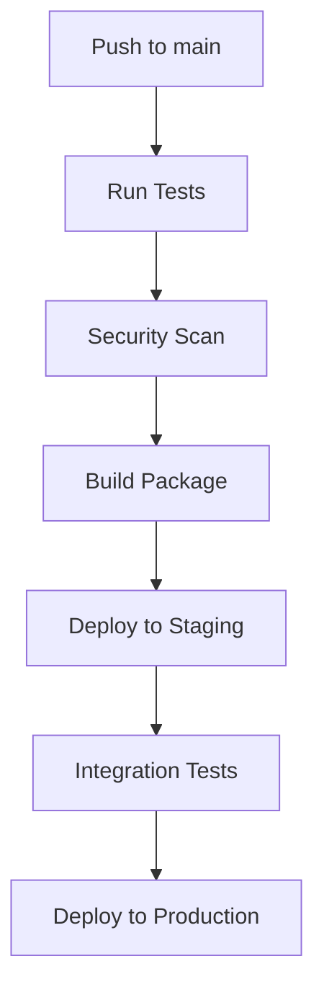

# Deployment Guide

## Overview

This document outlines the deployment process for the Heart Disease Prediction system, covering both API and ML model deployments.

## Table of Contents

1. [Prerequisites](#prerequisites)
2. [Environment Setup](#environment-setup)
3. [Deployment Process](#deployment-process)
4. [Validation](#validation)
5. [Monitoring](#monitoring)
6. [Rollback Procedures](#rollback-procedures)

## Prerequisites

### Required Access
- GitHub repository access
- Deployment environment credentials
- Cloud platform access
- Monitoring system access

### Required Tools
- Python 3.11+
- Docker
- kubectl (for Kubernetes deployments)
- GitHub CLI

## Environment Setup

### 1. Configure Environment Variables

```bash
# Required for all environments
export DEPLOYMENT_ENV=<environment>  # development|staging|production
export API_KEY=<api-key>
export MODEL_PATH=/path/to/models

# Production only
export MONITORING_KEY=<key>
export ALERT_WEBHOOK=<webhook-url>
```

### 2. Environment Configuration

Each environment has specific configurations in `config/environments.yml`:

- Development: Local testing and development
- Staging: Pre-production validation
- Production: Live system

## Deployment Process

### 1. CI/CD Pipeline

The deployment process is automated through GitHub Actions:



### 2. Manual Deployment

If needed, manual deployment can be performed:

```bash
# 1. Deploy API
./scripts/deploy_api.sh --environment production \
    --version v1.0.0 \
    --api-key $API_KEY

# 2. Deploy Models
./scripts/deploy_models.sh --version v1.0.0 \
    --api-key $API_KEY
```

## Validation

### 1. Pre-deployment Checks

```bash
# Validate configurations
python scripts/validate_config.py --env production

# Check dependencies
python scripts/check_dependencies.py

# Validate models
python scripts/validate_models.py
```

### 2. Post-deployment Validation

```bash
# API health check
curl https://api.example.com/health

# Run integration tests
pytest tests/test_api_integration.py

# Validate model performance
python scripts/validate_model_performance.py
```

## Monitoring

### 1. Metrics

Key metrics to monitor:

- Response time (95th percentile)
- Request rate
- Error rate
- Model prediction accuracy
- Resource utilization

### 2. Alerts

Configure alerts for:

- High error rates (>1%)
- High response times (>200ms)
- Low prediction accuracy (<80%)
- Resource constraints

## Rollback Procedures

### 1. API Rollback

```bash
# Rollback to previous version
./scripts/rollback_api.sh --version <previous-version>

# Verify rollback
python scripts/validate_api.py
```

### 2. Model Rollback

```bash
# Rollback models
./scripts/rollback_models.sh --version <previous-version>

# Verify model performance
python scripts/validate_model_performance.py
```

## Security Considerations

### 1. Access Control
- API key rotation schedule
- Role-based access control
- IP allowlisting

### 2. Data Protection
- Data encryption in transit
- Secure model storage
- Audit logging

## Troubleshooting

### Common Issues

1. **High Response Times**
   - Check resource utilization
   - Review concurrent requests
   - Validate caching

2. **Model Performance Degradation**
   - Check input data distribution
   - Validate model artifacts
   - Review prediction logs

3. **Deployment Failures**
   - Check deployment logs
   - Verify environment configuration
   - Validate dependencies

## Best Practices

1. **Deployment**
   - Always deploy to staging first
   - Run full test suite before production
   - Monitor closely after deployment

2. **Configuration**
   - Use environment-specific configs
   - Never commit secrets
   - Version control configurations

3. **Validation**
   - Automated testing
   - Performance validation
   - Security scanning

## Appendix

### A. Configuration Reference

```yaml
production:
  api_url: https://api.example.com
  monitoring:
    enabled: true
    metrics_port: 9090
  security:
    rate_limit: 1000
    allowed_origins:
      - https://app.example.com
```

### B. Deployment Checklist

- [ ] Run security scan
- [ ] Update documentation
- [ ] Deploy to staging
- [ ] Run integration tests
- [ ] Review metrics
- [ ] Deploy to production
- [ ] Verify deployment
- [ ] Monitor performance

